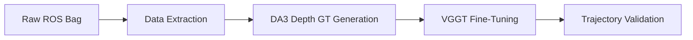

<div align="center">
<h1>VGGT: Visual Geometry Grounded Transformer</h1>

<a href="https://jytime.github.io/data/VGGT_CVPR25.pdf" target="_blank" rel="noopener noreferrer">
  
</a>
<a href="https://arxiv.org/abs/2503.11651"></a>
<a href="https://vgg-t.github.io/"></a>
<a href="https://huggingface.co/spaces/facebook/vggt"></a>

**[Visual Geometry Group, University of Oxford](https://www.robots.ox.ac.uk/~vgg/)**; **[Meta AI](https://ai.facebook.com/research/)**

[Jianyuan Wang](https://jytime.github.io/), [Minghao Chen](https://silent-chen.github.io/), [Nikita Karaev](https://nikitakaraevv.github.io/), [Andrea Vedaldi](https://www.robots.ox.ac.uk/~vedaldi/), [Christian Rupprecht](https://chrirupp.github.io/), [David Novotny](https://d-novotny.github.io/)
</div>

---

# 🚀 VGGT Rosbag & Depth-Anything-3 Fine-Tuning Extension

This repository has been extended to support a complete pipeline for **fine-tuning VGGT camera tracking and depth estimation on custom ROS bag data**. It features a robust multi-view conversion pipeline, metric ground truth depth estimation via **Depth-Anything-3**, custom dataloaders, and trainer enhancements to ensure stable convergence on lower-resource GPUs.



## Table of Contents
0. [Outdoor Depth & VGGT-Omega Fine-Tuning Tips](#0-outdoor-depth--vggt-omega-fine-tuning-tips)
1. [Data Extraction & Conversion (ROS Bag to Multi-View Format)](#1-data-extraction--conversion-ros-bag-to-multi-view-format)
2. [Ground Truth Metric Depth Generation (Depth-Anything-3)](#2-ground-truth-metric-depth-generation-depth-anything-3)
3. [Core Training & Dataloader Enhancements](#3-core-training--dataloader-enhancements)
4. [Fine-Tuning Execution](#4-fine-tuning-execution)
5. [Trajectory Visualization & Validation](#5-trajectory-visualization--validation)
6. [Repository Code Layout](#6-repository-code-layout)

---

## 0. Outdoor Depth & VGGT-Omega Fine-Tuning Tips

Fine-tuning spatial transformers on raw **outdoor datasets** presents severe visual and geometric challenges. Long-range horizons, complex foliage, dynamic lighting, and highly **sparse/poor active LiDAR depth readings** can easily destabilize camera tracking and depth convergence. 

To overcome these, this pipeline adopts the **fine-tuning best practices pioneered by VGGT-Omega**:

### A. Foundation Model Distillation for Dense Depth
Outdoor LiDAR often provides sparse points or fails on highly reflective/absorbent surfaces (e.g. water, glass, distant skies). Rather than supervising on noisy or sparse physical depth, we use **Depth-Anything-3** (`DA3NESTED-GIANT-LARGE`) to distill dense, temporally consistent, metric depth ground-truth maps offline.

### B. Sky-Masking & Infinite Capping
As recommended in VGGT-Omega's training protocols, attempts to learn depth for distant skies leads to massive gradient spikes. We isolate sky pixels using ONNX-based semantic masks and cap depth values at a constant background range (**50.0 meters**), directing model gradients away from unlearnable infinite space.

### C. Catastrophic Forgetting Mitigation (Feature Freezing)
To preserve the excellent zero-shot generic geometry representations learned by the Visual Geometry Grounded Transformer, the core patch aggregator is frozen via `frozen_module_names` in the YAML configuration. You can execute the training pipeline with:
```bash
cd training
python3 launch.py --config cubifyanything_vggt_fixed
```
This forces backpropagation to exclusively adapt the lightweight tracking/camera and depth heads to the custom camera trajectory distribution, preventing catastrophic geometry forgetting.

### D. AMP Scaler Backoff & NaN Resilience
Outdoor trajectories can experience high-frequency VIO noise, causing massive gradients. The custom training loop implements an **AMP Scaler backoff check** which automatically catches infinite/NaN loss, zeros the optimizer, decreases the scale factor, and skips the batch gracefully instead of crashing the training process.

---

## 1. Data Extraction & Conversion (ROS Bag to Multi-View Format)

The training pipeline uses folder-based multi-view structures containing synchronized images, intrinsic camera parameters (`k`), and extrinsic camera poses (`rt`). The primary tool for raw dataset generation is:
`tools/convert_rosbag_to_cubify_extracted.py`

### Spatial odometry calibration and alignment
Because mobile robot odometry (e.g., from VIO/Kimera) is represented in a different spatial coordinate system than the camera's optical frame, the script automatically applies a motion alignment matrix:

```python
# Force Camera Forward (Z) to point along the Robot Motion Axis
R_MOTION_ALIGNED = np.array([
    [ 1,  0,  0, 0],
    [ 0,  0, -1, 0],
    [ 0,  1,  0, 0],
    [ 0,  0,  0, 1]
], dtype=np.float32)
```

### Execution Command:
```bash
python tools/convert_rosbag_to_cubify_extracted.py \
    --bag /path/to/raw_odometry.bag \
    --output-root ml-cubifyanything/data/extracted/rosbag \
    --color-topic /sparkal1/forward/color/image_raw/compressed \
    --depth-topic /sparkal1/forward/depth/image_rect_raw \
    --pose-topic /sparkal1/kimera_vio_ros/odometry \
    --min_disparity 10.0 \
    --downsample 1
```
*   `--min_disparity`: Triggers optical flow keyframe selection, saving frames only when enough pixel displacement has occurred to prevent sequence stagnation.
*   `--no-lidar` / `--allow-no-depth`: Allows running the extraction process on color-only ROS bags.

---

## 2. Ground Truth Metric Depth Generation (Depth-Anything-3)

To fine-tune VGGT depth predictions without active physical LiDAR sensors, the pipeline leverages the **Depth-Anything-3** (`DA3NESTED-GIANT-LARGE`) transformer to generate metric depth maps offline.
This is implemented in `depth_anything_3/generate_depths.py` and uses two key stages:

### A. Sky Segmentation Masking
Learning metric depth in infinite space (e.g. skies/horizons) causes model gradients to explode. We use `skyseg.onnx` to isolate pixels corresponding to the sky and hardcode their depth values to a background limit (50.0 meters):

```python
# Apply Sky Masking to prevent learning metric depth for infinite space
sky_mask = segment_sky(image_path, skyseg_session, mask_filename=mask_path)
depth[sky_mask < 128] = 50.0  # Cap sky depth at 50 meters
```

### B. Dynamic Intrinsic Rescaling
When resizing the generated depth maps to match VGGT's standard target training resolution (`640x480`), we dynamically rescale the camera K-matrix parameters (`fx`, `fy`, `cx`, `cy`) to ensure mathematical consistency:

```python
# Scaling focal lengths and principal points to match target resolution
scale_w = target_w / depth.shape[1]
scale_h = target_h / depth.shape[0]
intrinsics[0, 0] *= scale_w  # fx
intrinsics[1, 1] *= scale_h  # fy
intrinsics[0, 2] *= scale_w  # cx
intrinsics[1, 2] *= scale_h  # cy
```

### Execution Command:
```bash
python depth_anything_3/generate_depths.py
```
This script will parse the extracted `.wide` folder trees, segment skies, run DA3 metric inference, and save identical metric `uint16` depth maps in both the wide and ground truth directories.

---

## 3. Core Training & Dataloader Enhancements

Training feed-forward visual geometry transformers requires long sequences and is highly sensitive to training instabilities. We introduced three critical reliability improvements:

### A. GPU Memory Leak Prevention
During gradient accumulation, intermediate tensors tend to remain in CUDA memory. The trainer actively clears cache blocks at the end of each backward pass and validation step:
```python
# Freeing sequence tensors from GPU memory
del batch
torch.cuda.empty_cache()
```

### B. NaN / Inf Loss Fallback Loop
When gradient scaling spikes or sequences contain unstable configurations, standard PyTorch training crashes. We implemented a robust skip-and-backoff mechanism:
```python
try:
    self._run_steps_on_batch_chunks(chunked_batches, phase, loss_meters)
except RuntimeError as e:
    if "Loss is" in str(e) and "attempting to stop" in str(e):
        logging.error(f"⚠️  SKIPPING BATCH due to NaN/Inf loss: {e}")
        # Back off the gradient scaler to reduce optimization steps gracefully
        current_scale = self.scaler.get_scale()
        self.scaler.update(new_scale=current_scale * self.scaler.get_backoff_factor())
        
        # Zero out optimizers to clear bad gradients
        for optim in self.optims:
            optim.zero_grad()
        continue
    else:
        raise e
```

---

## 4. Fine-Tuning Execution

To begin fine-tuning camera tracking and depth estimation on your extracted rosbag sequences, navigate to the `training/` folder and use the Hydra-backed launch wrapper:

```bash
cd training
python3 launch.py --config cubifyanything_vggt_fixed
```

> [!TIP]
> **Performance Benchmark**: Fine-tuning this custom sequence for **40 epochs** takes approximately **2.5 hours on an NVIDIA A6000 GPU**.

### 📥 Pre-trained Model Checkpoint Setup
Before starting any training run, you must download the pre-trained VGGT base weights (`model.pt`) and place them inside the `vggt/models/` folder to match the `resume_checkpoint_path` defined in the configuration files:
- **Target Location**: `vggt/models/model.pt`
- Ensure the directory is prepared before starting the training wrapper:
  ```bash
  mkdir -p vggt/models/
  # Place the downloaded 'model.pt' checkpoint in this directory
  ```

### Running Without VGGT-Omega Training Enhancements (Vanilla Config)
If you wish to run the training process *without* the VGGT-Omega optimizations, you can use the vanilla configuration file:
- **Active Prediction Confidence Loss**: Enables standard `loss_conf_depth` weighting (setting `gamma: 1.0` and `alpha: 0.2`).
- **Disabled Cosine Scheduling**: Employs a steady, constant learning rate scheduler rather than a decaying warm-up curve.

To launch the vanilla training run:
```bash
cd training
python3 launch.py --config cubifyanything_vggt_vanilla
```

Configuration details are managed inside:
- **Omega-Optimized**: [cubifyanything_vggt_fixed.yaml](training/config/cubifyanything_vggt_fixed.yaml)
- **Vanilla/Baseline**: [cubifyanything_vggt_vanilla.yaml](training/config/cubifyanything_vggt_vanilla.yaml)

---

## 5. Trajectory Visualization & Validation

Once training completes, you can inspect loaded weights, plot trajectory normalizations, and evaluate prediction errors against ground truth coordinates.

*   **Plotting Ground Truth Poses**:
    ```bash
    python notebooks/visualize_camera_poses.py
    ```
*   **Comparing Predicted Trajectories to GT**:
    ```bash
    python notebooks/visualize_predicted_vs_gt_poses.py
    ```
*   **Interactive Analysis**:
    Open the Jupyter Notebook `notebooks/VGGT_Checkpoint_Verification_UPDATED.ipynb` to dynamically check trajectory scaling, coordinate projection metrics, and visualize camera poses.

---

## 6. Repository Code Layout

This snapshot extends the native VGGT structure as follows:

```
vggt-rosbag-snapshot/
├── tools/
│   ├── convert_rosbag_to_cubify_extracted.py   # Main ROS bag translator
│   ├── convert_kimera_to_vggt.py               # Kimera VIO pose alignment
│   └── compare_datasets.py                     # Data structure verification
├── depth_anything_3/
│   └── generate_depths.py                      # DA3 depth GT generator
├── training/
│   ├── finetune_cubifyanything.py              # Configuration compiler & runner
│   ├── trainer.py [MODIFIED]                   # Memory-safe, NaN-resilient trainer
│   ├── loss.py [MODIFIED]                      # Trajectory and depth loss functions
│   ├── config/
│   │   ├── default.yaml [MODIFIED]             # Base Hydra configurations
│   │   └── cubifyanything_vggt_fixed.yaml      # Specific rosbag yaml configs
│   └── data/
│       ├── pose_normalizer.py                  # Coordinate centering and scaling
│       ├── collate.py                          # Multi-sequence collator
│       ├── dynamic_dataloader.py [MODIFIED]     # Safety sequence checking dataloader
│       └── datasets/
│           └── cubifyanything_extracted.py     # Extracted folder-based dataset
├── notebooks/
│   ├── VGGT_Checkpoint_Verification_UPDATED.ipynb  # Interactive verification
│   ├── visualize_camera_poses.py               # Render 3D paths
│   └── visualize_predicted_vs_gt_poses.py      # Predicted vs GT trajectory plotter
```

---

*For original VGGT documentation, quick-start setup, Gradio demos, and COLMAP export features, see below.*

---

## Original VGGT Quick Start & Details

First, clone this repository to your local machine, and install the dependencies (torch, torchvision, numpy, Pillow, and huggingface_hub). 

```bash
pip install -r requirements.txt
```

Now, try the model with just a few lines of code:

```python
import torch
from vggt.models.vggt import VGGT
from vggt.utils.load_fn import load_and_preprocess_images

device = "cuda" if torch.cuda.is_available() else "cpu"
dtype = torch.bfloat16 if torch.cuda.get_device_capability()[0] >= 8 else torch.float16

model = VGGT.from_pretrained("facebook/VGGT-1B").to(device)

image_names = ["path/to/imageA.png", "path/to/imageB.png", "path/to/imageC.png"]  
images = load_and_preprocess_images(image_names).to(device)

with torch.no_grad():
    with torch.cuda.amp.autocast(dtype=dtype):
        predictions = model(images)
```

For viser and colmap visualization, please read the original sections below.

## License
All code is under a commercial-use-friendly license (see LICENSE.txt). Model weights and pre-trained checkpoints are licensed according to Facebook Research terms.
